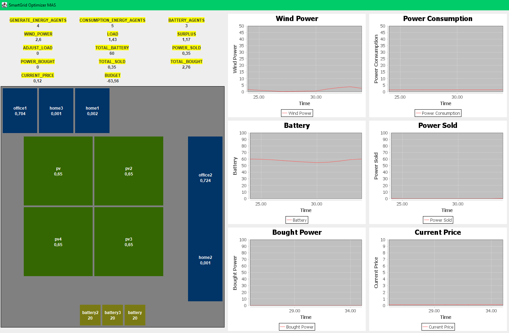

# ⚡️🌐 SmartGrid Optimizer Multi-Agent System

SmartGrid Optimizer is a distributed energy management system designed to optimize the operation of smart grids. It utilizes a multi-agent system framework to efficiently manage energy production, load, and storage across different locations in an electrical grid.

This project is based on an agent-centric development approach, implemented using the JADE (Java Agent DEvelopment Framework) framework. Agents, autonomous software entities capable of decision-making and action-taking in a specific environment, play a pivotal role in coordinating and optimizing the operations of the electrical grid.

## 🚀 Features

- **🛠️ Multi-Agent System Integration**: Utilizes JADE (Java Agent DEvelopment Framework) for implementing a multi-agent system architecture.
- **📊 Report Generation**: Generates detailed reports and analysis using Jaspersoft Reports.
- **🖥️ Graphical User Interface (GUI)**: Provides a user-friendly GUI developed in Java Swing for visualizing simulation results and generated reports.
- **🔄 Optimization Algorithms**: Implements optimization algorithms to maximize the use of renewable energy sources and minimize operational costs.
- **🌐 Scalability and Flexibility**: Offers a flexible and scalable tool for simulating and analyzing distributed energy systems.
- **⚙️ Dynamic Parameter Adjustment with JMX**: Integrates Java Management Extensions (JMX) with Java Mission Control to enable real-time adjustment of parameters governing the behavior of agents. This functionality allows users to fine-tune system settings on-the-fly, optimizing performance and responsiveness to changing environmental conditions or user preferences.

## 🤖 What is a Multi-Agent System?

A **Multi-Agent System (MAS)** is a computational system composed of multiple autonomous agents that interact with each other and their environment to achieve individual and collective goals. Each agent operates independently, possesses its own knowledge, and has the ability to perceive, reason, and act based on its internal state and external stimuli.

In the context of SmartGrid Optimizer, agents represent various entities within the electrical grid ecosystem, such as energy generators, consumers, batteries, and market intermediaries. These agents collaborate and compete to optimize energy production, distribution, and consumption, leading to efficient grid operation and resource utilization.

## 💡 Advantages of a Multi-Agent System Approach

* **🏛️ Decentralization:** A MAS distributes decision-making and control across multiple agents, allowing for decentralized and distributed management of complex systems. This leads to increased scalability and robustness, as the system can adapt to changes without relying on a central authority.
* **🌀 Flexibility and Adaptability:** Agents in a MAS are autonomous and capable of learning and adaptation. This enables the system to dynamically respond to changes in the environment, user preferences, and system requirements, leading to more flexible and adaptive behavior.
* **🔗 Modularity and Reusability:** MAS promotes a modular design where agents encapsulate specific functionalities or behaviors. This modular structure enhances reusability, as agents can be easily repurposed or replaced to accommodate different scenarios or requirements.
* **⚙️ Efficiency and Optimization:** By leveraging distributed intelligence and collaboration, MAS can achieve global optimization and resource allocation. Agents can coordinate their actions to achieve collective goals, leading to improved efficiency and performance.
* **📈 Scalability:** MAS exhibits inherent scalability, as the addition of new agents does not necessarily impact the overall system complexity or performance. This allows the system to scale gracefully with increasing size or complexity, making it suitable for large-scale applications.
* **🔒 Resilience and Fault Tolerance:** MAS can exhibit robustness and fault tolerance due to their decentralized nature. Failure or malfunction of individual agents does not necessarily disrupt the entire system, as other agents can compensate or take over responsibilities, ensuring continued operation.

## 🎯 Unraveling the Choice: Agent-Oriented Approach Over Object-Oriented Paradigm

🔍 Delving into the Selection: Reasons for Opting for the Agent-Oriented Paradigm
In the development journey of the SmartGrid Optimizer, the decision to embrace the agent-oriented paradigm over the object-oriented approach wasn't arbitrary but a meticulously considered choice. 
Here, we unravel the rationale behind this strategic selection and illuminate the distinctive advantages it brings to the table.

The key difference between the agent paradigm and the object-oriented approach lies in the autonomy and dynamic adaptability of agents. While in the object-oriented approach, objects are passive and respond to predefined messages, agents are autonomous entities capable of perceiving their environment, making decisions, and taking actions independently. This fundamental difference has a significant impact on the flexibility and responsiveness of the system to changes in the environment and goals.

* **🔄 Dynamic Adaptability:** In an environment such as energy management systems, where conditions can change rapidly due to factors like the availability of renewable resources or fluctuations in energy demand, agents' dynamic adaptability is essential to optimize system performance.
* **📡 Decentralized Communication:** The agent paradigm allows for decentralized communication among system entities, facilitating coordination and collaboration between different components without relying on a central controller. This is crucial in a context where multiple agents must interact to achieve common goals.
* **🧩 Modeling Complex Systems:** Energy management systems are inherently complex, with multiple variables and dynamic relationships between different components. The agent-oriented approach provides a natural way to model this complexity by allowing the creation of autonomous entities that can adapt and make decisions based on their environment.
* **📈 Flexibility and Scalability:** When designing an energy management system, it is essential to have a flexible and scalable architecture that can adapt to different scenarios and size requirements. The agent paradigm offers this flexibility by allowing for easy addition or removal of agents as needed, facilitating system expansion and the incorporation of new functionalities.

In summary, the choice of the agent-oriented approach for developing the energy management system is based on its ability to provide an adaptable, decentralized, and flexible solution that can address the complexity and dynamics of the modern energy environment.

## 🧩 Unraveling the Agents

### BatteryAgent

The BatteryAgent simulates the behavior of a battery within the energy management system. It is responsible for storing and retrieving energy based on system requirements. When it receives a "StoreInBattery" message, indicating an excess of energy to be stored, it increases its battery level accordingly. Conversely, when it receives a "RetrieveDemand" message, indicating a demand for energy to be met, it decreases its battery level accordingly. Additionally, the BatteryAgent periodically notifies subscribers of its current battery level to provide real-time updates on its status within the system.

### ControllerAgent
The ControllerAgent serves as the main coordinating agent within the energy management system. It orchestrates the interaction among other agents such as energy generators, consumers, and batteries to ensure efficient energy distribution and utilization.

#### Key Responsibilities:
Monitoring Energy Generation and Consumption: The ControllerAgent continuously monitors the generation of energy by energy-producing agents and the consumption of energy by load-consuming agents.

* **Optimizing Energy Distribution:** Based on the observed surplus or deficit of energy, the ControllerAgent makes decisions to optimize energy distribution. It coordinates the storage of excess energy in batteries, the retrieval of stored energy from batteries, and the buying or selling of energy to balance supply and demand.
* **Communication and Coordination:** The ControllerAgent communicates with other agents in the system to gather information about available energy resources, current energy demand, and battery levels. It coordinates actions among different agents to ensure smooth operation of the energy management system.

#### Behavioral Overview:

* **Subscription to Energy Agents:** The ControllerAgent subscribes to notifications from energy-generating agents, load-consuming agents, and battery agents to receive updates on energy generation, consumption, and battery levels.
* **Periodic Monitoring:** It periodically checks the balance between energy generation and consumption and takes appropriate actions to maintain system stability.
* **Initiating Energy Transactions:** When necessary, the ControllerAgent initiates energy transactions such as storing surplus energy in batteries, retrieving stored energy from batteries, and buying or selling energy in the market.

#### Integration with JMX and JADE:
* **JMX Integration:** The ControllerAgent exposes its status and operations through JMX for monitoring and management purposes.
* **JADE Framework Usage:** It leverages the capabilities of the JADE (Java Agent DEvelopment Framework) platform for implementing multi-agent communication and coordination.

### MarketAgent
The MarketAgent acts as an intermediary for buying and selling energy within the energy management system. It facilitates transactions between energy producers and consumers, monitors market prices, and manages budgets.

#### Key Responsibilities:
* **Buying and Selling Energy:** The MarketAgent processes requests from agents to buy or sell energy to/from the grid. It keeps track of the total power bought and sold over time.
* **Price Management:** It periodically updates the current market price based on external factors such as supply and demand. The MarketAgent notifies subscribers about changes in the market price.
* **Budget Monitoring:** The agent maintains a budget based on the difference between total energy sold and bought multiplied by the current market price. It periodically checks and updates the current budget.

### Behavioral Overview:

* **Request Handling:** The MarketAgent handles requests from other agents to buy or sell energy, as well as requests for obtaining the current market status.
* **Price Update:** It periodically updates the market price based on predefined values, notifying subscribers about the new price.
* **Budget Check:** The agent periodically checks and updates the budget based on energy transactions and current market prices.

### PowerGenerateAgent
The PowerGenerateAgent represents an agent responsible for generating energy within the energy management system. It simulates the generation of power based on predefined data and reports the generated energy periodically.

#### Key Responsibilities:
* **Energy Generation:** The agent simulates energy generation based on predefined data loaded from a CSV file. It periodically reports the generated energy to subscribers.
* **Status Reporting:** It responds to requests for obtaining the current status by providing information about the currently generated power.

#### Behavioral Overview:
* **Request Handling:** The PowerGenerateAgent handles requests from other agents to obtain the current status.
* **Periodic Reporting:** It periodically reports the generated energy to subscribers based on predefined data loaded from a CSV file.

### PowerLoadAgent
The PowerLoadAgent represents an agent responsible for generating loads within the energy management system. It simulates the consumption of power based on predefined data and reports the consumption periodically.

#### Key Responsibilities:
* **Power Load Generation:** The agent simulates power load generation based on predefined data loaded from a CSV file. It periodically reports the generated power load to subscribers.
* **Load Update Handling:** It responds to requests for updating the power load by adjusting the current load consumption.
* **Status Reporting:** The agent provides information about the current power consumption upon request.

#### Behavioral Overview:
* **Request Handling:** The PowerLoadAgent handles requests from other agents to update the load or obtain the current status.
* **Periodic Reporting:** It periodically reports the power load consumption to subscribers based on predefined data loaded from a CSV file.

### ReportAgent
The ReportAgent is responsible for generating periodic reports based on system status information. It collects iteration status data and generates reports in PDF or XLS format, which can be configured and managed through JMX operations.

#### Key Responsibilities:
* **Report Generation:** The agent collects iteration status data from other agents and generates reports periodically based on this information.
* **Format Configuration:** Reports can be generated in either PDF or XLS format, and the agent allows for changing the report format dynamically using JMX operations.
* **Report Folder Management:** The agent manages the folder where generated reports are saved, enabling users to specify a custom folder location.
 
#### Behavioral Overview:
* **Status Subscription:** The ReportAgent subscribes to iteration status updates from other agents to collect the necessary data for report generation.
* **Periodic Report Generation:** It periodically generates reports based on the collected iteration status data, using predefined JasperReports templates and exporting the reports in the specified format.
* **JMX Integration:** The agent exposes JMX operations to allow for dynamic configuration of the report folder and format, enhancing flexibility and manageability.

### ClientAgent
The ClientAgent is responsible for monitoring and interacting with various agents in the system. It subscribes to agent services, queries their status periodically, and facilitates communication for changing power consumption measures.

#### Key Responsibilities:
* **Agent Monitoring:** The ClientAgent monitors different types of agents, including battery agents, power-generating agents, and energy-consuming agents. It observes changes in their status and updates the graphical user interface accordingly.
* **Service Subscription:** It subscribes to specific services provided by other agents using the DF service. These services include reporting iteration status, total power bought and sold, battery level, power generation, and power consumption.
* **Status Querying:** The agent periodically queries the status of subscribed agents to collect information about battery levels, power generation, and energy consumption.
* **Power Consumption Control:** It facilitates the control of power consumption by sending requests to load energy agents to change power consumption measures based on user input from the GUI.

#### Behavioral Overview:
* **Initialization:** The ClientAgent initializes by registering the SL codec and SmartGrid ontology, setting up the graphical user interface (GUI), and subscribing to relevant agent services.
* **Agent Observation:** It observes changes in the availability of different types of agents by subscribing to DF notifications for battery agents, power-generating agents, and energy-consuming agents.
* **Periodic Status Querying:** The agent employs a ticker behavior to periodically query the status of subscribed agents and update the GUI with the latest information.
* **GUI Event Handling:** It handles GUI events, such as requests to change power consumption measures, by sending appropriate messages to load energy agents.

#### Integration with DF and GUI:
* **DF Subscription:** The ClientAgent subscribes to agent services using DF subscription initiators to receive notifications about agent availability and changes in service provision.
* **GUI Interaction:** It interacts with the GUI by updating the displayed agent status and responding to user input for changing power consumption measures.

## Application Demonstration

### Graphical User Interface (GUI)
Below are screenshots of the application's graphical user interface (GUI), which allows users to visualize simulation results and access various functionalities:

### 🔄 Real-time Parameter Adjustment with JMC
The system enables real-time parameter adjustment using Java Mission Control (JMC) and Java Management Extensions (JMX). Users can monitor and modify system parameters dynamically, optimizing the system's operation based on changing conditions and requirements.

### 🌐 Interaction with Agents using JADE
Users can interact with the system's agents using the JADE tool, accessing agent information, sending messages, and initiating actions to control and coordinate agent behavior in the simulated environment.

